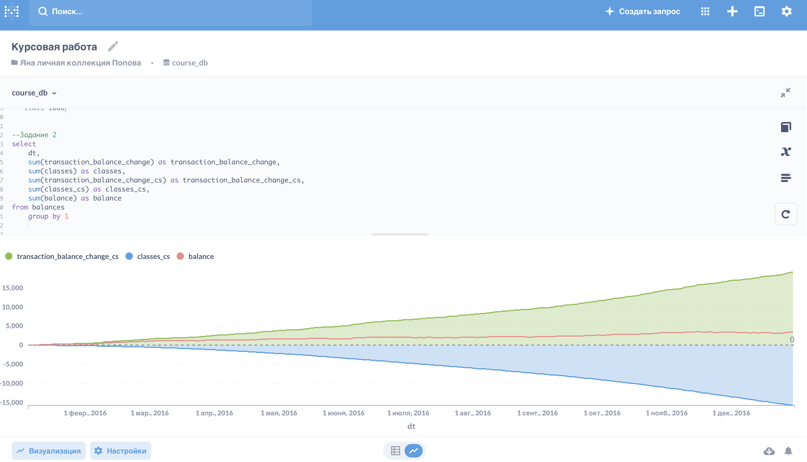
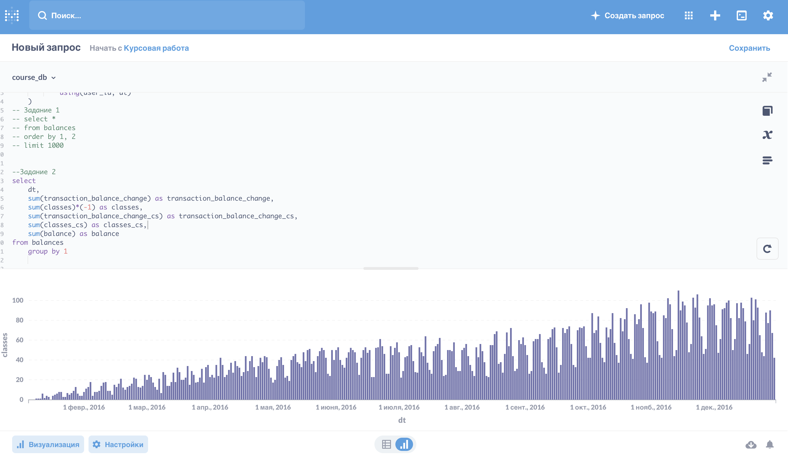
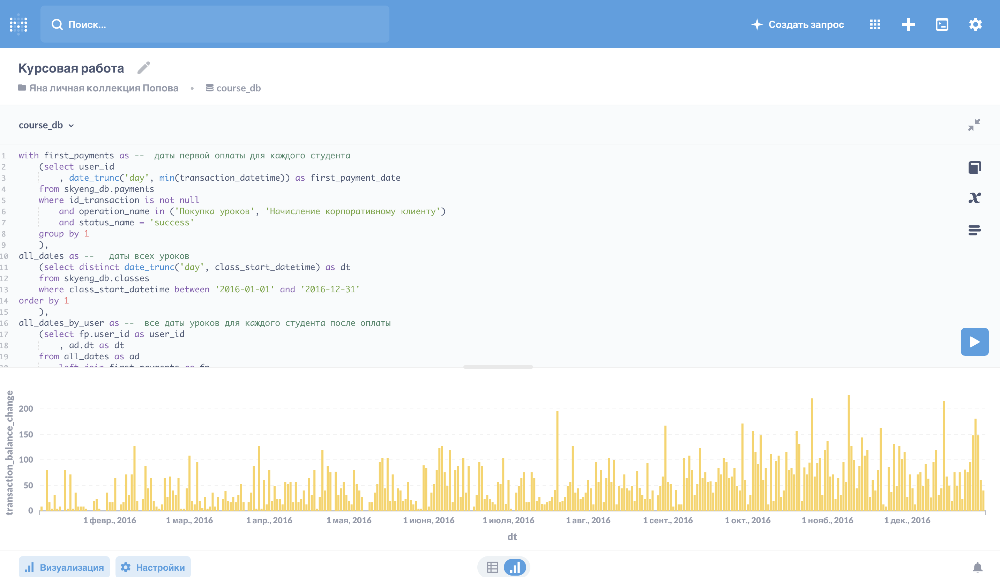
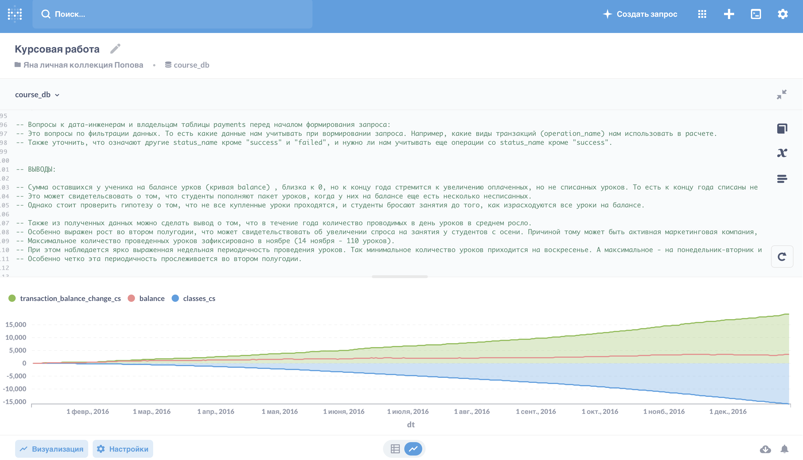

## SQL-запрос - моделирование изменения балансов студентов онлайн-школы

## Задача

Смоделировать изменение балансов студентов.

Баланс — это количество уроков, которое есть у каждого студента.
Чтобы проверить, всё ли в порядке с нашими данными, составьте список гипотез и вопросов.

Нам важно понимать:

* сколько всего уроков было на балансе всех учеников за каждый календарный день;
* как это количество менялось под влиянием транзакций (оплат, начислений, корректирующих списаний) и уроков (списаний с баланса по мере прохождения уроков).

Также мы хотим создать таблицу, где будут балансы каждого студента за каждый день.

### Результат работы

В результате должен получиться запрос, который собирает данные о балансах студентов за каждый "прожитый" ими день.

## Решение

1)	Узнали, когда была первая транзакция для каждого студента. Начиная с этой даты, собрали его баланс уроков. Создали CTE `first_payments` с двумя полями: `user_id` и `first_payment_date` (дата первой успешной транзакции). 

2)	Собрали таблицу с датами за каждый календарный день 2016 года. Выбрали все даты из таблицы `classes`, создали CTE `all_dates` с полем `dt`, где будут храниться уникальные даты (без времени) уроков.

3)	Узнали, за какие даты имеет смысл собирать баланс для каждого студента. Для этого объединили таблицы и создали CTE `all_dates_by_user`, где будут храниться все даты жизни студента после того, как произошла его первая транзакция. 

4)	Нашли все изменения балансов, связанные с успешными транзакциями. Выбрали все транзакции из таблицы `payments`, сгруппировали их по `user_id` и дате транзакции (без времени) и нашли сумму по полю `classes`. В результате получили CTE `payments_by_dates `с полями: `user_id`, `payment_date`, `transaction_balance_change` (сколько уроков было начислено или списано в этот день). 

5)	Нашли баланс студентов, который сформирован только транзакциями. Для этого объединили `all_dates_by_user` и `payments_by_dates `так, чтобы совпадали даты и `user_id`. Использовали функцию `sum`, чтобы найти кумулятивную сумму по полю `transaction_balance_change `для всех строк до текущей включительно с разбивкой по `user_id` и сортировкой по` dt`. В результате получим CTE `payments_by_dates_cumsum `с полями: `user_id`, `dt`, `transaction_balance_change — transaction_balance_change_cs` (кумулятивная сумма по `transaction_balance_change`). 

6)	Нашли изменения балансов из-за прохождения уроков. Создали CTE `classes_by_dates`, посчитав в таблице `classes` количество уроков за каждый день для каждого ученика. Нас не интересуют вводные уроки и уроки со статусом, отличным от `success` и `failed_by_student`. Получили результат с такими полями: `user_id`, `class_date`, `classes` (количество пройденных в этот день уроков). Причем `classes` мы умножили на -1, чтобы отразить, что - — это списания с баланса.

7)	По аналогии с уже проделанным шагом для оплат создали CTE для хранения кумулятивной суммы количества пройденных уроков. Для этого объединили таблицы `all_dates_by_user` и `classes_by_dates` так, чтобы совпадали даты и `user_id`. Использовали функцию `sum`, чтобы найти кумулятивную сумму по полю `classes` для всех строк до текущей включительно с разбивкой по `user_id` и сортировкой по `dt`. В результате получили CTE `classes_by_dates_dates_cumsum` с полями: `user_id`, `dt`, `classes — classes_cs`(кумулятивная сумма по `classes`). (При подсчете кумулятивной суммы заменяем пустые значения нулями).

8)	Создали CTE `balances` с вычисленными балансами каждого студента. Для этого объединили таблицы `payments_by_dates_cumsum` и `classes_by_dates_dates_cumsum `так, чтобы совпадали даты и `user_id`. 

9)	Из полученной выборки отобрали топ-1000 строк (из CTE `balances`) с сортировкой по `user_id `и `dt`. Посмотрели на изменения балансов студентов (задание 1). 

10)	Создали визуализацию (линейную диаграмму) итогового результата. 

11)	Сделали выводы о полученных результатах. 

## Выводы

Сумма оставшихся у ученика на балансе урков (кривая balance) , близка к 0, но к концу года стремится к увеличению оплаченных, но не списанных уроков. То есть к концу года списаны не все уроки, купленные в течение этого года.

Это может свидетельсвовать о том, что студенты пополняют пакет уроков, когда у них на балансе еще есть несколько несписанных. 

Однако стоит проверить гипотезу о том, что не все купленные уроки проходятся, и студенты бросают занятия до того, как израсходуются все уроки на балансе. 

Также из полученных данных можно сделать вывод о том, что в течение года количество проводимых в день уроков в среднем росло. 

Особенно выражен рост во втором полугодии, что может свидетельствовать об увеличении спроса на занятия у студентов с осени. Причиной тому может быть активная маркетинговая компания, или повышение интереса к обучению с началом нового учебного года/возвращения из летних отпусков.

Максимальное количество проведенных уроков зафиксировано в ноябре (14 ноября - 110 уроков).

При этом наблюдается ярко выраженная недельная периодичность проведения уроков. Так минимальное количество уроков приходится на воскресенье. А максимальное - на понедельник-вторник и четверг-пятницу.

Особенно четко эта периодичность прослеживается во втором полугодии.

